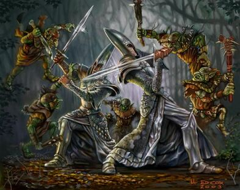

В РПГ играх персонажи ежедневно сражаются с противниками. За удачные сражения они получают опыт и тем самым совершенствуются…

В реальной жизни тебе, наверное, редко предстоит сражаться с гоблинами или драконами, поэтому в качестве твоих противников выступают твои дела.

Все задачи в [РПГ Органайзере](https://nerdistway.blogspot.ru/2013/07/mylife-rpg-organizer.html) делятся на два типа:

- **Привычки** - повторяющиеся задачи. Сделал зарядку сегодня - завтра надо повторить!
- **Дела** - просто задачи. Позвонить Васе. Купить хлеба. Подготовить отчет и.т.д.

Задачи типа "дела" могут складываться в цепочку миссий и становиться "[квестами](https://life-rpg-organizer.fandom.com/ru/wiki/Квесты)". А от задач типа "привычки" зависит твоя крутость, за них ты будешь получать опыт.

В РПГ Органайзере задачи тоже называются "монстрами". При создании задачи ей даже присваивается случайное изображение противника! Естественно, со временем и ростом твоей крутости монстры будут более страшными и коварными!