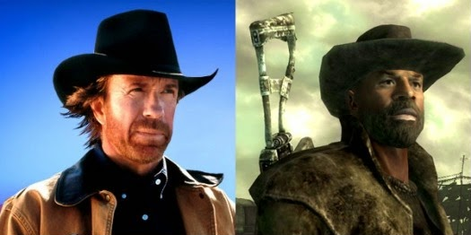

Любая РПГ игра начинается с создания персонажа.​ 

Персонаж в РПГ - виртуальный аватар, взаимодействующий с игровой вселенной. Сначала он слаб и безызвестен, но в процессе игры можно достичь максимального уровня и тогда жизнь становится великолепной - открывается возможность входить в особые зоны, носить специальные доспехи и играючи достигать любых целей. 

*В реальности все еще интереснее! Мы создадим персонажа игры жизни, которым будешь ты сам!*

Концепция персонажа полезна, потому что:

-   Позволит выделить параметры, развитие которых сделает тебя круче.
-   Даст удобный инструмент для численного измерения достижений.
-   Предоставит мотивацию и систему вознаграждений, благодаря которым ты обязательно достигнешь своих целей.
-   Позволит создать воображаемый образ того, каким хочешь стать и постепенно стать тем, кем хочешь))) Это игра по твоим правилам, победа в которой преследует твои цели!