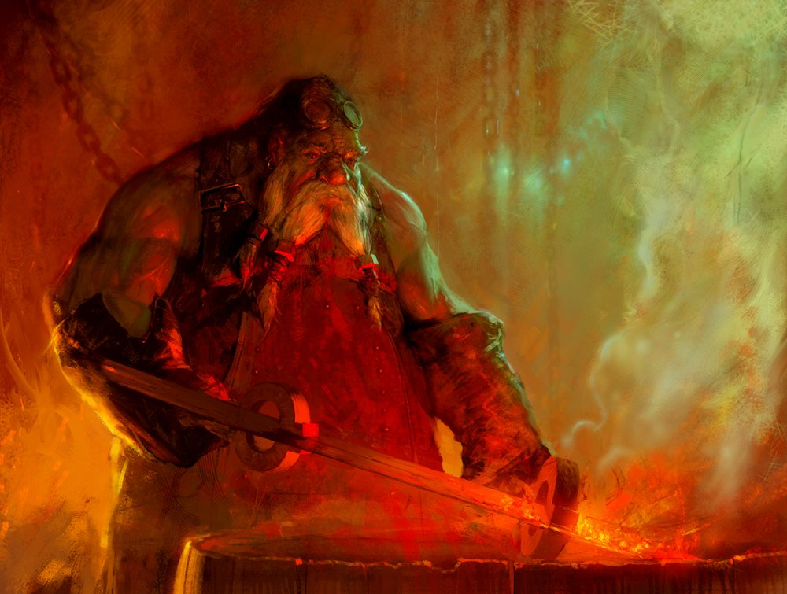

Еще одна мера крутости в РПГ это навыки. Искусность в специфичных действиях вроде стрельбы из лука, магии земли, ношении доспехов, взлома и.т.д. 

В реале у нас тоже есть навыки, от которых зависит наша крутость: сопротивление фастфуду, ежедневное чтение, зарядка, программирование - вот примеры навыков реальной жизни. Главная цель РПГ Органайзера - сделать сложный и нудный процесс формирования полезных навыков увлекательным.

:::info &nbsp;
**Навыки - это более конкретная и специфичная мера твоего развития, чем характеристики.**
:::

## Что мы имеем ввиду под навыками?

> Навык - это действие, доведенное до автоматизма
>
> —  Википедия

В самом простейшем виде под навыком мы будем принимать привычку:

- **Хочешь изучить программирование?** Если будешь кОдить каждый день понемногу - будешь прокачивать навык. Забросишь - навык будет деградировать. 
- **Освоить английский?** Просто читай на иностранном понемногу каждый день.
- **Йога?** Приобрети привычку заниматься на постоянной основе и все будет тип-топ!

:::info &nbsp;

Повторяющиеся задачи (привычки) развивают навыки!

:::

## Навыки влияют на характеристики

Какое у тебя здоровье и как ты выглядишь на 99% следствие твоих хороших или плохих привычек. Если ты пьешь, куришь и ругаешься матом, то у тебя проблемы с характеристиками – **ЗДОРОВЬЕ** и **ХАРИЗМА**. Тренируясь играть на гитаре на гитаре, улучшаешь **ОБАЯНИЕ**. Читая умные книги– **ИНТЕЛЛЕКТ**, рисуя – **МЫШЛЕНИЕ**. То есть навыки развивают характеристики (*что в конечном счете делает тебя круче*). Поэтому В РПГ Органайзере каждый навык связан с той или иной характеристикой, а развивать характеристики можно только прокачивая навыки.

Примеры навыков и характеристик, которые они прокачивают:

| Навык                     | Характеристика |
| ------------------------- | -------------- |
| Утренняя зарядка          | Здоровье       |
| Йога                      | Ловкость       |
| Полезная еда              | Здоровье       |
| Полезный завтрак          | Здоровье       |
| Сопротивление вредной еде | Здоровье       |
| Аккуратность              | Харизма        |
| Шахматы                   | Мышление       |
| Программирование          | Интеллект      |
| Бодибилдинг               | Сила           |
|                           | и.т.д.         |

:::info &nbsp;

Характеристики нельзя прокачивать напрямую, но можно их развивать, прокачивая навыки!

:::

## Навыки имеют градацию

Навыки - это измеряемая вещь. Как в твоей любимой РПГ игре навык "файербол" с ростом уровня позволяет тебе кастовать более большие и мощные огненные шары, также и в реале навык "отжимания" будет иметь градацию уровней сложности и его прокачка будет увеличивать количество раз, сколько ты сможешь отжаться. И.т.д.