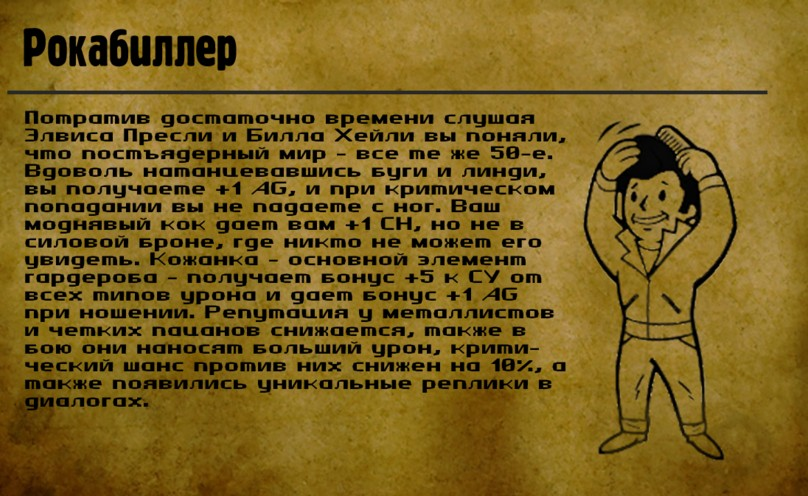

Перки (особенности) - это твои преимущества, некая особенная черта, элемент личности, отличительная особенность игрового персонажа.  Вообще - это очень распространенное понятие в РПГ играх, наибольшую известность они получили в игре [Fallaut](https://fallout.fandom.com/ru/wiki/Fallout_2).

В РПГ Органайзере под перками мы будем также принимать твои привычки, как и навыки, только они не имеют градацию по уровням. Они либо есть, либо нет. Вроде "сопротивления алкоголю" или "вождения автомобиля". Тут тебе надо проявить немного фантазии - ты сам решаешь, какие качества будут навыками, а какие - перками.