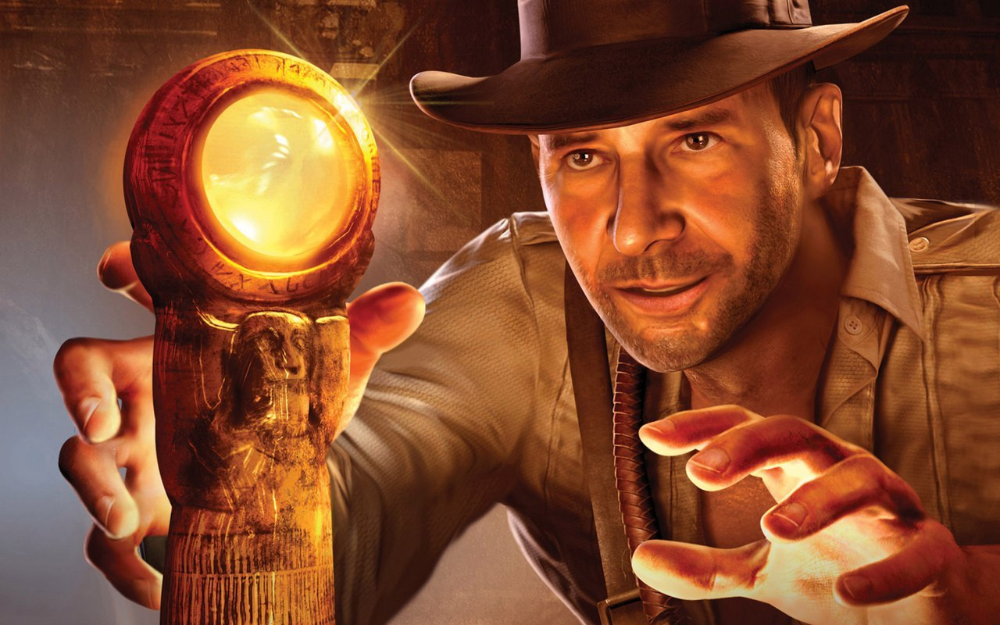

Еще одна полезная штука из РПГ игр, которая может пригодиться - квесты.

Квест это обособленная цель, поставленная перед персонажами игроков в ходе развития игрового сюжета. Её выполнение является источником удовольствия от игры, порой принося персонажам материальные и нематериальные блага, или просто предоставляя возможность интересно и увлекательно провести время.

В реальной жизни когда мы хотим достичь чего-то, мы тоже ставим перед собой цели, но многих целей мы не достигаем, а в РПГ выполнение квестов доставляет огромное удовольствие и даже трудные задачи решаются играючи. Поэтому, чтобы цель стала квестом нужно [выполнить ряд необходимых условий](http://nerdistway.blogspot.com/2013/08/blog-post.html).

Если совсем вкратце, то под квестами в РПГ Органайзере мы принимаем правильно сформулированную цель или проект, настроенный чтобы тебя мотивировать и за который в конце будет НАГРАДА.
