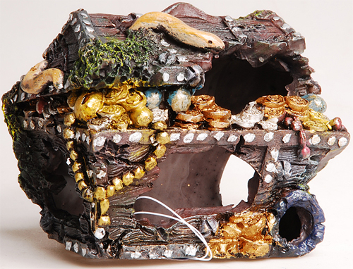

В героических сагах искателями приключений не всегда движет только лишь альтруизм и желание помочь ближним, а также жажда наживы, редких артефактов, золота и славы! Реальная жизнь ничем не лучше! Но и не хуже!

Для того, чтобы поддерживать твою мотивацию на высоком уровне, в РПГ Органайзере есть "награды". Покупка новых солнечных очков (+5 к харизме), поход в IMax на любимый фильм (*+3 к удовлетворенности*), вкусный ужин в ресторане и просто +1000 рублей в фонд "побаловать себя" - вот примеры наград в реальной жизни!

Все награды делятся на два типа:

- **Трофеи:** Которые ты получаешь случайным образом после выполнения задач. Как в РПГ играх, когда из монстра "выпадает" бонус.
- **Артефакты:** Которые ты получаешь, достигнув цели. Как в РПГ, когда побеждаешь Босса, или выполняешь КВЕСТ.

Награды будут служить дополнительным источником мотивации для твоих героических свершений!