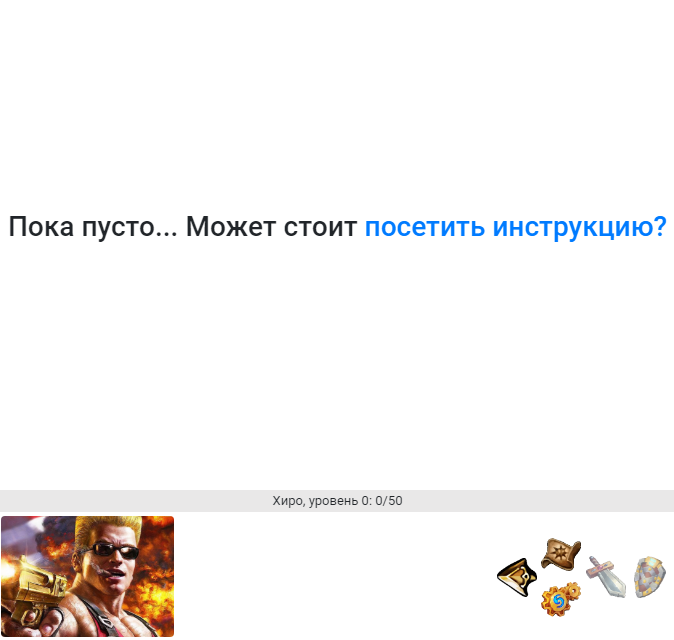

Сейчас мы пройдем небольшой туториал, где ты опробуешь основные функции и решишь - действительно ли готов к [прокачке в реале](http://nerdistway.blogspot.com/2013/08/blog-post_5490.html)?!

**Внимание! Начинается игра!**

Это - первый шаг в твоем (*супер*)геройском пути! Начнем?!

Ты начинаешь игру никому не известным слабым персонажем нулевого уровня. Цель игры - прокачать персонажа (*и тебя тоже*) до максимального уровня (*у каждого он свой*). Чтобы прокачиваться, нужно побеждать монстров (*в их роли будут выступать твои ежедневные дела*). За победы ты будешь получать очки опыта - EXP (**EX**perience **P**oints). При достижении порогового значения EXP, будет получен новый уровень и несколько **О**чков **Н**авыков (*ОН*), на которые можно развивать навыки (*тебе станут доступны новые задания, дающие больше опыта*).

... Сейчас ты находишься на... давай будем называть это место "Главное окно":

Здесь обычно будет происходить все самое интересное. Позже тут появятся задания, но сейчас пусто.

Перейди на "Экран персонажа":

