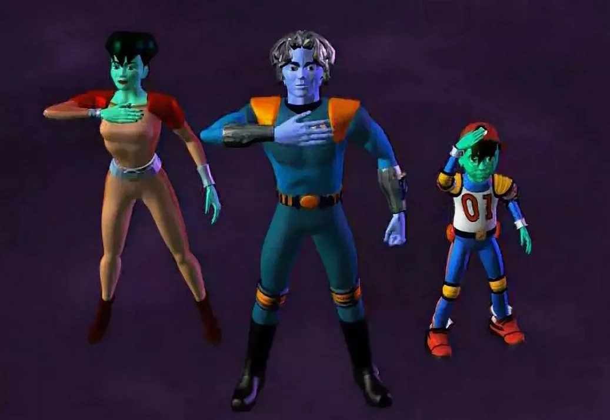
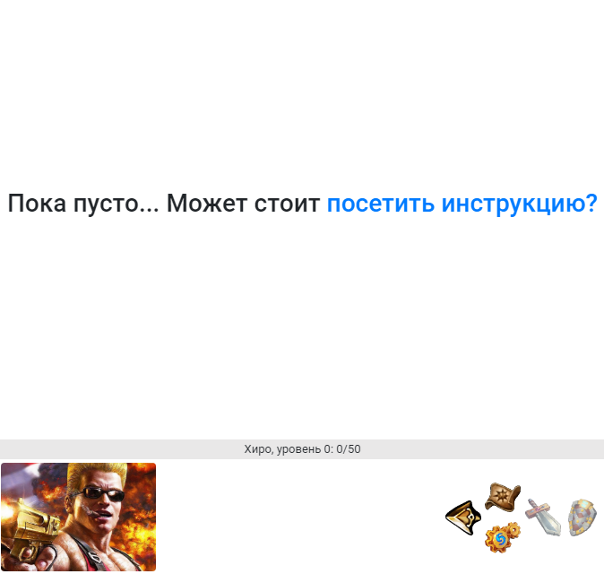
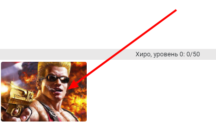

**Внимание! Начинается игра!**

Это - первый шаг в твоем (супер)геройском пути! Давай начнем?!

Ты начинаешь игру никому не известным слабым персонажем нулевого уровня. Цель игры - прокачать персонажа (и тебя тоже) до максимального уровня (100). Чтобы прокачиваться, нужно побеждать монстров (в их роли будут выступать твои ежедневные дела). За победы ты будешь получать очки опыта - EXP (**EX**perience **P**oints). При достижении порогового значения EXP, будет получен новый уровень и несколько **О**чков **Н**авыков (ОН), на которые можно развивать навыки (тебе станут доступны новые задания, дающие больше опыта).

Сейчас ты находишься на... давай будем называть это место "Главное окно":

Это - главное окно. Здесь обычно будет происходить все самое интересное. Чуть позже здесь появятся задания, но сейчас тут пусто. Нужно создать персонажа и "начать игру".

Если ты впервые запустил РПГ Органайзер, уже загрузился "тренировочный персонаж". Ты можешь посмотреть его, перейдя на "Экран персонажа":

А что нужно сделать, чтобы игра началась, мы сейчас узнаем...