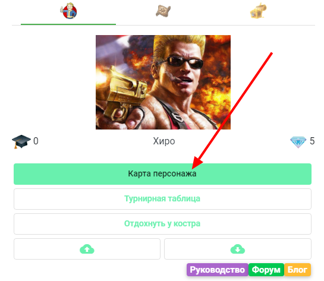
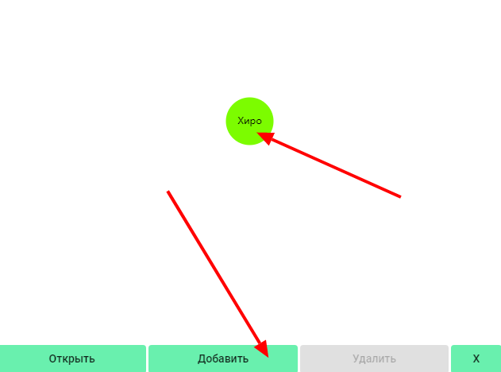
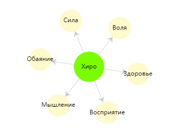

Делаем крупные мазки в твоем героическом портрете - настраиваем характеристики!

Для начала ответь на вопрос - "Чего ты хочешь?". Такие характеристики и добавляй. Хочешь быть умным и сильным - тогда "сила" и "ум". Хорошо себя чувствовать - тогда "выносливость" или "здоровье". Или может быть "уверенность", "мудрость" или "боевой дух"? Ты сам решаешь)))

Есть несколько способов добавить характеристики, но я тебе покажу самый простой и наглядный. Начнем [Mind Mapping](https://mel.fm/blog/rafael-tyncherov1/8194-chto-takoye-karty-uma-i-kak-zarisovat-tsely-uchebnik)!

Чтобы открыть функцию "карты ума" - на экране персонажа нажми здесь:

Затем тыкни по имени твоего персонажа, появятся кнопки действий. Нажми "добавить", чтобы создать характеристику.

Впиши название характеристики и нажми "Ок". Повтори, добавив остальные характеристики. У тебя получится что-то вроде этого:

Напоминаю - характеристики это основные качества, определяющие твою крутость. Ограничься 5-7 такими параметрами...