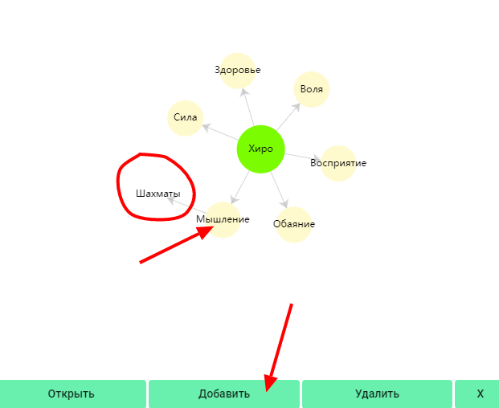
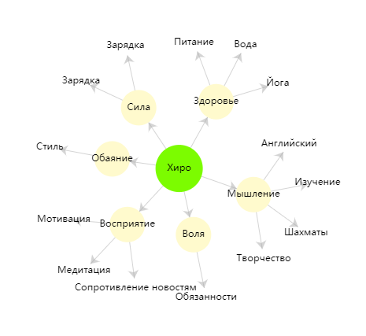

Как я говорил раньше, каждый навык будет "связан" с соответствующей характеристикой. [Навыки](/about-abils) развивают характеристики, а характеристики в основном служат для группировки навыков и более общей статистики твоего прогресса (*чуть позже ты поймешь о чем это я*).

Сейчас посмотри на свою карту персонажа и подумай - как можно развивать добавленные характеристики? Например, силу можно развивать спортом, мышление - ежедневной игрой в шахматы или чтением умных книг, а здоровье - йогой и правильным питанием.

Придумал? Тогда нажми на одну из характеристик, затем кнопку "добавить" и впиши название навыка.

Таким образом добавь несколько навыков к каждой характеристике. У меня получилось что-то вроде этого:

Я думаю, персонально для себя ты придумаешь что-то намного круче))

:::info &nbsp;

Если ты хочешь избавиться от какой-то вредной привычки, напиши ее название в "достигательном виде". Например - "сопротивление фастфуду/курению/порно..." 

То есть ты не будешь избавляться от чего-то, а будешь приобретать что-то. Сопротивление или контроль, назови как-нибудь прикольно)))

:::