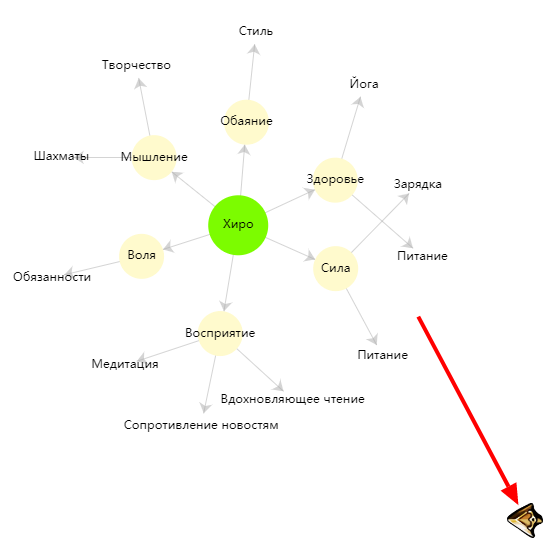
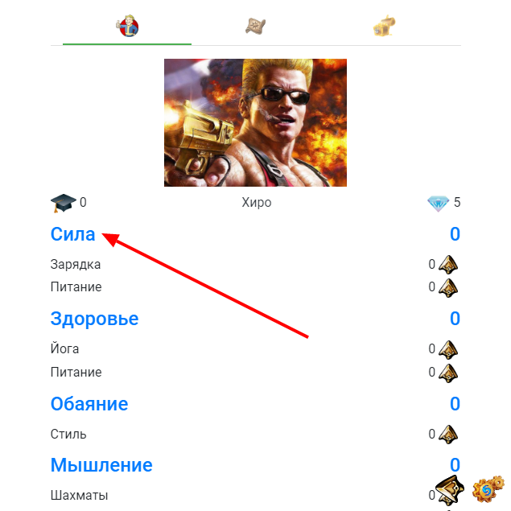
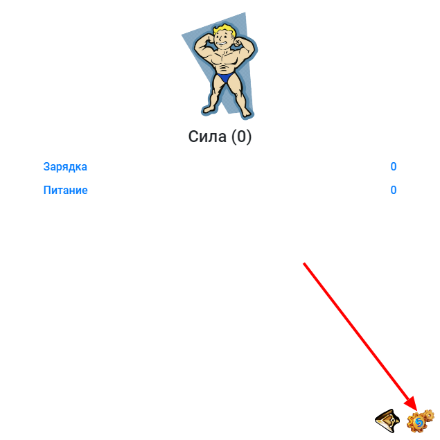
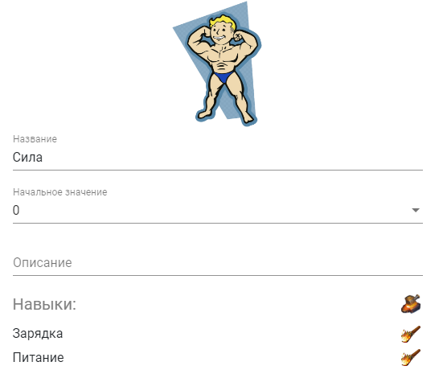
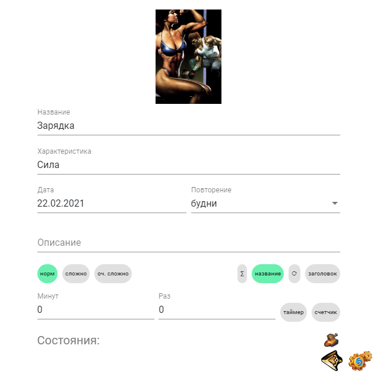

Сейчас вернись на экран персонажа:

На основе "карты ума" у тебя будет настроенный персонаж со всеми характеристиками и навыками. Но можно сделать все еще чуть-чуть круче...

## Донастройка характеристик

Нажми на одну из характеристик:

Перейди в режим редактирования:

И донастрой следующие поля:

- **Описание характеристики** - что она представляет для тебя, чего поможет добиться, когда будет круто прокачана, за что она отвечает?
- **Начальный уровень** - может быть у тебя уже есть какие-то успехи в этом качестве? Выбери начальное значение от 0 (полный лох) до 10 (невероятно крут).
- **Картинка** - нажми на изображение по умолчанию и выбери наиболее подходящее из встроенной библиотечки, либо укажи "путь в интернете".
- **Навыки** - может быть нужно добавить еще навыков?
- Повтори эти действия с остальными характеристиками...

:::warning &nbsp;

Не забудь сохранить! Нажми эту кнопку, когда все настроишь:

:::

## Донастройка навыков

Также нажми на один из навыков персонажа... Вбей описание и картинку...

Не забудь сохранить))

Там есть еще куча настроек, но об этом чуть позже)))