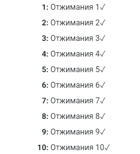

Сейчас будет самый нудный (*а для кого то самый интересный*) этап в настройке персонажа РПГ Органайзера. А еще он самый важный. Не ленись пожалуйста!

Тебе нужно будет прощелкать по каждому навыку и настроить для него прокачку по уровням. Если ты это сделаешь сейчас, потом тебе не надо будет тратить время и силы на планирование. Ты в курсе, что [мы функционируем в двух режимах](https://nerdistway.blogspot.com/2020/12/blog-post.html)? Это сильно [сбережет твои очки силы воли](https://nerdistway.blogspot.com/2013/12/blog-post_27.html)! К тому же ты будешь видеть свой путь героя.

Открой первый навык из списка:

Перейди в режим редактирования:

## Настройка повторений

Как ты помнишь, навыки развиваются повторяющимися задачами. Настрой это:

## Сложность

Тут настраивается сложность навыка:

## Перк?

Если это "Перк":

## Прокачка по уровням

А теперь ответь на вопросы: "В чем можно измерить крутость навыка?" и "Какая финальная цель в прокачке этого навыка?". Есть несколько вариантов настройки.

### Делать что-то X минут

Например, это навык "Чтение" и твоя конечная цель - читать умные книги каждый день по 40 минут. Тогда укажи эти 40 минут в это поле:

Если нажмешь сохранить, увидишь как автоматически настроятся уровни навыка:

### Делать что-то X раз

Например, это будет навык "Отжимания". В финале ты хочешь отжиматься каждый день по 50 раз. Тогда укажи эти 50 раз здесь:

Навыки автоматически распределятся по уровням:

### На каждом уровне будут разные задания

Например - навык "Сопротивление отвлечениям". Ты хочешь игнорировать соцсети до вечера, но не можешь достичь этого сразу. Тогда заполни "подзадачи" следующим образом:

Автоматическое распределение по уровням будет таким:

### С каждым уровнем будут добавляться задания

Например, ты хочешь приобрести навык "сопротивление вредной еде". В конце ты хочешь больше не питаться фастфудом, газировкой, снэками, майонезом и не перекусывать. Например))) Тогда заполни подзадачи и тыкни на значок "сумма":

Автоматическое распределение будет таким:

### Задания будут чередоваться

Например, это навык "Зарядка". И ты хочешь чередовать "отжимания" и "приседания" через день. Тогда сделай так:

Получится это:

Нажав эту кнопку, можно сменить задачи. Также они будут автоматом сменяться после успешного выполнения задачи.

### Настройки, кстати, можно комбинировать)))

Давай возьмем предыдущий пример и добавим туда количество раз:

Будет вот так:

### Скрыть заголовок

Например, навык называется как-то абстрактно, а задача более конкретно, ты можешь скрыть название навыка в главном окне, сняв выделение отсюда:

Тогда задача будет выглядеть так:

## Дерево навыков

Для совсем извращенцев)) Если ты хочешь настроить, чтобы, например, навык "зарядка" можно было открыть только после прокачки навыка "сопротивление вредной еде" до 10 уровня, проделай следующее:

Тогда на "карте персонажа" это будет выглядеть так:

А у навыка "Зарядка" появится требование, без выполнения которого он будет неактивен:

В конце настройки каждого навыка не забудь сохранить:

А теперь переходи к следующему навыку...

Может быть этот этап займет у тебя достаточно долгое время, но это не важно, ведь этот этап сильно ускорит твое дальнейшее движение. Главное - знать [чего ты хочешь и кто ты](https://nerdistway.blogspot.com/2017/05/5.html)!