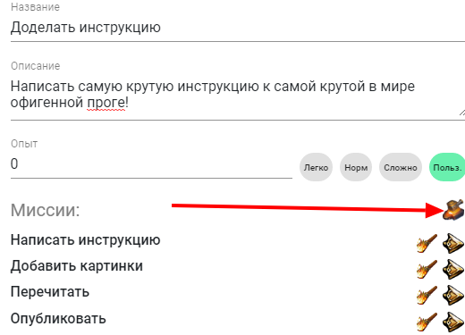

[Квесты](/about-qwests) - тоже важная штука в РПГ Органайзере. Они помогают тебе достигать целей (не забывай про [условия создания хорошего квеста](https://nerdistway.blogspot.com/2013/08/blog-post.html)).

Чтобы настроить новый квест - перейди на вкладку:

Теперь перейди в редактирование (*нажми шестеренку в правом нижнем углу*):

Добавь новый квест:

Сохрани (*опять нажми шестеренку*):

Перейди в инфу по квесту (*тык!*):

В режим редактирования (*нажми шестеренку*):

Настрой квест)))

## Основная информация о квесте

Тыкни по **изображению** и выбери подходящее из библиотеки:

Или введи путь из интернета:

Настрой **название** и **описание**:

Укажи миссии квеста:

Их кстати можно двигать перетаскиванием (*перетаскивай, нажимая на этот значок*):

## Награда за квест

Как я уже говорил, у каждого квеста [должна быть причина, и должен быть результат](https://nerdistway.blogspot.com/2013/08/blog-post.html). Награда создаст мотивацию к следующим свершениям и даст лучше почувствовать "вкус победы" - ощущение, очень важное для скромных ботанов.

В общем, за квест желательно назначить награду. Это может быть просто очки опыта (*чем сложнее, тем больше опыта, или укажи число вручную*):

Или какая то вещь. Тогда добавь "артефакт":

Когда квест будет выполнен, ты все получишь)

## Привязка к навыку

Если тебе нужно, чтобы например квест "Инструкция к РПГ Органайзеру" был связан с навыком "творчество", тогда добавь такую связь:

В этом случае в главном окне ты сможешь удобно перемещаться между навыком/квестом (*тык! тык!*):

А также этот квест будет скрыт из задач, если задача навыка в данный момент неактивна. Например, ты уже позанимался творчеством, и планируешь писать инструкцию завтра.

## Следующий квест

С помощью этого можно настроить целую историю. Например, после квеста "Инструкция" я хочу заняться квестом "Мой блог". Но пока инструкция не дописана, блогом я заниматься не планирую. Тогда нужно добавить к квесту "Инструкция" следующий квест "блог" (*кнопка наковальня - создать новый, шестеренка - выбрать из списка*).

Так это будет выглядеть в списке:

## Готово

В конце не забудь сохранить свое творчество! Нажми снова на шестеренку в правом нижнем углу.

Отлично! Вот так примерно это будет выглядеть! 

