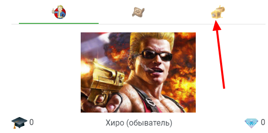
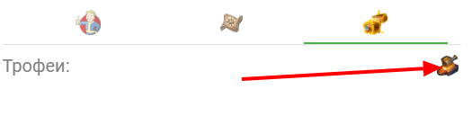
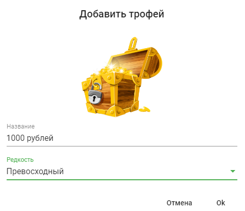
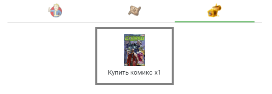

Трофеи в отличие от артефактов - это такие [награды](/about-rewards), которые ты получаешь случайным образом за сам факт выполнения задач. Это как когда ты побеждаешь противника в игре, а из него вываливается что-то прикольное. Трофеи - это еще один способ немного поднять твою мотивацию, согласись, получение награды, которую не ожидаешь - очень приятно!

:::info &nbsp;

Только помни! Главная мотивация должна быть внутри тебя! РПГ Органайзер это инструмент,который помогает тебе, но не тот, что делает все за тебя!

Немного фантазии, настойчивости и страсти не повредят!

:::

Бывают следующие типы наград: обычная, превосходная, редкая, магическая и легендарная. Обычные "выпадают" намного чаще "легендарных". Следовательно в качестве легендарных наград выбирай что-то действительно эпичное, чем наградить себя)

Примеры наград в реальной жизни:
-   500 рублей.
-   1000 рублей.
-   2000 рублей.
-   Поход в кино.
-   Поход в кафе
-   Пицца!
-   Книга.
-   Фильм.
-   Ананасы!

## Добавление трофея

На странице персонажа перейди на вкладку "инвентарь":

И активируй режим редактирования (*шестеренка в правом нижнем углу*).

Затем нажми на кнопку "добавить трофей":

В появившемся окне укажи название награды, а также ее тип и картинку.

Иногда ты будешь получать награды за выполнение квестов или при выполнении задач. Полученные награды попадут в "инвентарь" на экране персонажа:

Когда будешь готов поощрить себя - наградись в реале, а затем щелкни по изображению награды в РПГ Органайзере.

## Готово

На этом создание персонажа завершено. Но помни, что это непрерывный процесс. Ты все равно будешь периодически менять характеристики/навыки, донастраивать задачи, добавлять квесты/награды.

Но вообще, ты молодец! Я тобой горжусь!)))

Какие следующие действия? Прокачивай навыки, выполняй задачи, завершай квесты! Все как в [туториале с тренировочным персом!](/tutor-pers)