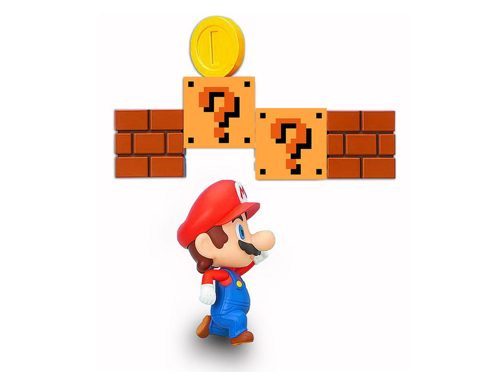

Все эти штуки нужны, чтобы ты мог спланировать ПУТЬ ГЕРОЯ. Четко увидеть, каким ты хочешь быть, какие шаги для этого нужны.

Представь себя художником, рисующем твой будущий портрет...

Сначала - история и имя героя. Потом, крупными мазками добавляем характеристики. Затем, маленькими штришками вырисовываем навыки. И в конце добавляем деталей в виде квестов и наград.

И вот ты уже четко перенес в реальный мир в виде плана к действию то, каким ты хочешь быть и ты можешь видеть это и ясно представлять все нюансы.

Как настроить все это в РПГ Органайзере? Читай дальше!